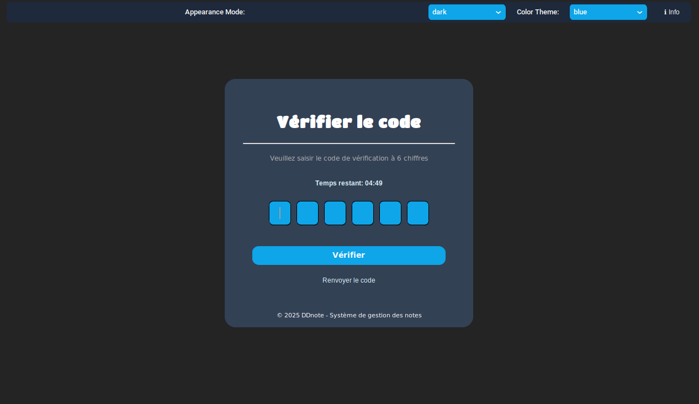
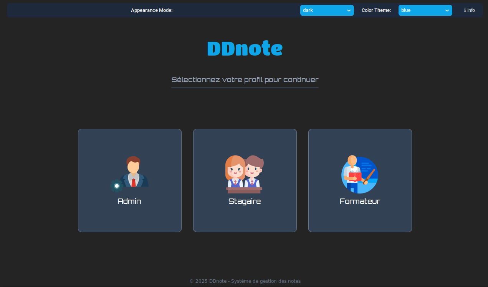

<div align="center">

# 🎓 DD-NOTE

### Système de Gestion des Notes avec Authentification OTP
  
[](https://github.com/BUGA-M/DD-NOTE/stargazers)
[](https://github.com/BUGA-M/DD-NOTE/network/members)
[](https://github.com/BUGA-M/DD-NOTE/blob/main/LICENSE)
[](https://www.python.org/)
[](https://github.com/TomSchimansky/CustomTkinter)


</div>

## 📋 À propos

**DD-NOTE-OFPPT** est une application de gestion académique de nouvelle génération, conçue spécifiquement pour les établissements ISTA. Développée en Python avec une interface graphique moderne, elle intègre un système de sécurité avancé incluant une vérification par code OTP et un chiffrement des données sensibles.

<div align="center">
<table>
<tr>
<td align="left" width="60%">

### ✨ Caractéristiques principales

- 📝 **Gestion complète des notes (contrôle, examen, moyenne, mention)**
- 📚 **Organisation des modules et des cours par filière et classe**
- 📅 **Suivi des absences avec justification et avertissements**
- 🎓 **Inscription et gestion administrative des étudiants ISTA**
- 🔐 **Authentification sécurisée par OTP**
- ⏱️ **Codes temporaires à validité limitée (5 minutes)**
- 🔄 **Réinitialisation de mot de passe sécurisée**
- 🌓 **Interface adaptative (thème clair/sombre)**
- 🖥️ **Design responsive et ergonomique**
- 🧩 **Architecture modulaire, évolutive et maintenable**
- 🔒 **Chiffrement Fernet des données sensibles**


</td>
<td width="40%">


<p align="center"><i>Interface de vérification OTP</i></p>

</td>
</tr>
</table>
</div>

## 🖼️ Aperçu de l'application

<div align="center">

<p><i>Interface d'accueil de DD-NOTE</i></p>
</div>

## 🚀 Guide d'installation

### Prérequis

- Python 3.11.2 ou supérieur
- Gestionnaire de paquets pip

### Installation en 4 étapes

<details>
<summary><b> 1️⃣  Cloner le dépôt</b></summary>

```bash
git clone https://github.com/BUGA-M/DD-NOTE.git
cd DD-NOTE
```
</details>

<details>
<summary><b> 2️⃣  Installer les dépendances</b></summary>

```bash
pip install -r requirements.txt
```

#### Dépendances principales
- customtkinter
- pillow
- cryptography
- python-dotenv
- pysqlcipher3
</details>

<details>
<summary><b> 3️⃣  Configuration du système</b></summary>

#### Créer un fichier `.env` à la racine
```
EMAIL_SENDER=votre_email@gmail.com
EMAIL_PASSWORD=votre_mot_de_passe_app
```
> **Note :** Pour Gmail avec 2FA, utilisez un [mot de passe d'application](https://support.google.com/accounts/answer/185833).

#### Créer le fichier `Backend/config.py`
```python
import os

# Clé de chiffrement Fernet
FERNET_KEY = b"votre_clé_fernet_générée"

# Configuration des chemins
BASE_DIR = os.path.dirname(os.path.abspath(__file__))
DATA_DIR = os.path.join(BASE_DIR, 'data')
os.makedirs(DATA_DIR, exist_ok=True)
DB_PATH = os.path.join(DATA_DIR, 'dd_note.db')
```

Pour générer une clé Fernet sécurisée :
```python
from cryptography.fernet import Fernet
print(Fernet.generate_key())
```
</details>

<details>
<summary><b> 4️⃣  Lancer l'application</b></summary>

```bash
python main.py
```
</details>

## 🏗️ Architecture du projet

```
DD-NOTE/
├── Backend/                # Logique métier et sécurité
│   ├── config.py           # Configuration et clés de chiffrement
│   ├── db/                 # Gestion de la base de données
│   ├── models/             # Modèles de données
│   ├── services/           # Services (OTP, email, etc.)
│   └── utils/              # Utilitaires et fonctions d'aide
├── Custom/                 # Composants UI personnalisés
│   ├── db_fonts/           # Polices personnalisées
│   ├── Pic/                # Images et ressources graphiques
│   ├── Button.py           # Boutons customisés
│   ├── Theme_controls.py   # Gestion des thèmes
│   └── ...                 # Autres éléments d'interface
├── Frontend/               # Écrans et interfaces utilisateur
│   ├── OTP.py              # Écran de vérification OTP
│   ├── connexion.py        # Écran de connexion
│   ├── Saisie.py           # Interface de saisie des notes
│   └── ...                 # Autres écrans
├── .env                    # Variables d'environnement (non versionné)
├── main.py                 # Point d'entrée de l'application
├── fernet_key.py           # Script pour générer la clé Fernet
├── .gitignore              # Fichiers à ignorer par git
├── pyproject.toml          # Configuration du projet Python (optionnel)
├── README.md               # Documentation du projet
└── requirements.txt        # Liste des dépendances

```

## 🛡️ Sécurité

DD-NOTE-OFPPT implémente plusieurs couches de sécurité :

- **Chiffrement Fernet** pour les mots de passe et données sensibles
- **Authentification multi-facteurs** via codes OTP envoyés par email
- **Validation temporelle** limitant la validité des codes à 5 minutes
- **Protection contre les accès non autorisés** aux fonctionnalités critiques
- **Base de données sécurisée** avec SQLCipher

## 🧪 Outils de développement

- **flake8** - Linting et vérification du code
- **bandit** - Analyse de sécurité du code
- **black** - Formatage automatique du code

## 📬 Contact

**BUGA-M** - [@github](https://github.com/BUGA-M)

**Lien du projet :** [https://github.com/BUGA-M/DD-NOTE](https://github.com/BUGA-M/DD-NOTE)

---

<div align="center">
    <table>
        <tr>
            <td align="center" width="25%">
                <div style="border-radius: 50%; overflow: hidden; width: 100px; height: 100px;">
                    
                </div>
                <a href="https://github.com/BUGA-M"></a>
            </td>
            <td align="center" width="25%">
                <div style="border-radius: 50%; overflow: hidden; width: 100px; height: 100px;">
                    
                </div>
                <a href="https://github.com/Youssef"></a>
            </td>
            <td align="center" width="25%">
                <div style="border-radius: 50%; overflow: hidden; width: 100px; height: 100px;">
                    
                </div>
                <a href="https://github.com/IMAD"></a>
            </td>
            <td align="center" width="25%">
                <div style="border-radius: 50%; overflow: hidden; width: 100px; height: 100px;">
                    
                </div>
                <a href="https://github.com/Abdellah"></a>
            </td>
        </tr>
    </table>
</div>

## 📬 Contactez-nous

<div align="center">

### Nous sommes à votre écoute pour toute question ou suggestion !

<a href="mailto:contact@dd-note.com"></a>
<a href="https://discord.gg/9Tdk89qyw5"></a>
<a href="https://www.linkedin.com/company/dd-note"></a>

<a href="https://github.com/BUGA-M/DD-NOTE"></a>

<p><i>Développé avec ❤️ pour les établissements ISTA de l'OFPPT</i></p>


</div>
